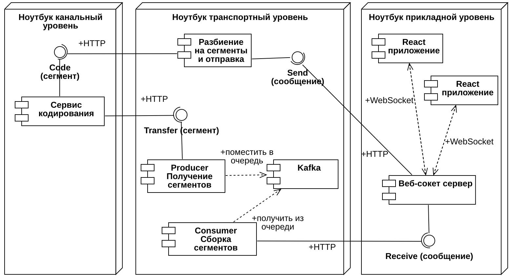

# Megachat - realtime-мессенджер с обнаружением и устанением помех

## О проекте

Проект представляет собой систему обмена текстовыми сообщениями в реальном времени, состояющую из трех уровней: прикладной, транспортный и канальный. Каждый из уровней реализуется отдельным веб-сервисом.

## Веб-серверы

### Требования к веб-серверам

#### Прикладной уровень

Интерфейс реализован на React + Redux Toolkit + Axios + MUI, дизайн должен копировать сайт российской компании. Он представляет собой окно чата с возможностью ввода текстового сообщения. При подключении необходимо ввести имя пользователя (открытие WebSocket соединения), которое будет передаваться с каждым сообщением. При обновлении страницы история чата не сохраняется. С помощью кнопки выйти можно отчистить чат и логин (закрытие WebSocket соединения), чтобы потом сменить пользователя. Если сообщение пришло с признаком ошибки - текст не отображается, а в чате отображается значок ошибки.

Для метода Send формирует json сообщение с указанием отправителя, времени отправки и полезной нагрузки - текста. При получении нового сообщения методом Receive - json с указанием отправителя, времени отправки, признака ошибки и полезной нагрузки.

#### Транспортный уровень

Текстовые сообщения разбиваются на сегменты по X байт и отправляются отдельными сегментами на канальный уровень.

При получении сегменты помещаются в очередь, раз в N секунд собираются в единое сообщение и передаются на прикладной уровень. Если часть из сегментов не была принята (1-3 цикла не было новых сегментов по этому сообщению), то на прикладной уровень итоговое сообщение передается с признаком ошибки.

Каждый пакет-сегмент представляет собой полезную нагрузку, времени отправки (как id сообщения), общую длину сообщения (количество сегментов), номер данного сегмента в сообщении.

#### Канальный уровень

Данный уровень эмитирует взаимодействие с удаленным сетевым узлом через канал с помехами. Для этого используется один из четырех вариантов кодирования передаваемых сообщений. Полученный от транспортного уровня json сегмента кодируется в битовый формат соответствующим кодом, вносятся ошибки и затем декодируется для последующей отправки обратно на транспортный уровень. Ошибка вносится в 1 случайный бит сегмента.

Сервис должен вносить ошибку с вероятностью P в передаваемую информацию и терять сообщения с вероятностью R. При декодировании либо пакет с ошибкой теряется, либо передается обратно на транспортный после исправления.

Пример: от транспортного уровня пришел сегмент 1000 бит, на канальном они кодируются [7，4] в кадр 1750 бит, в которые вносится ошибка, затем они снова декодируются в 1000 бит и передаются обратно на транспортный уровень в виде сегмента.

## Ресурсы

